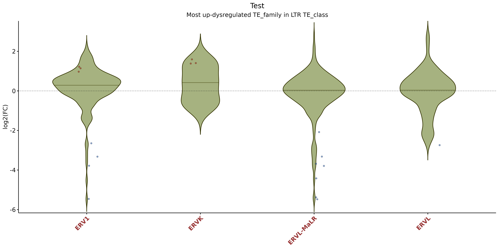
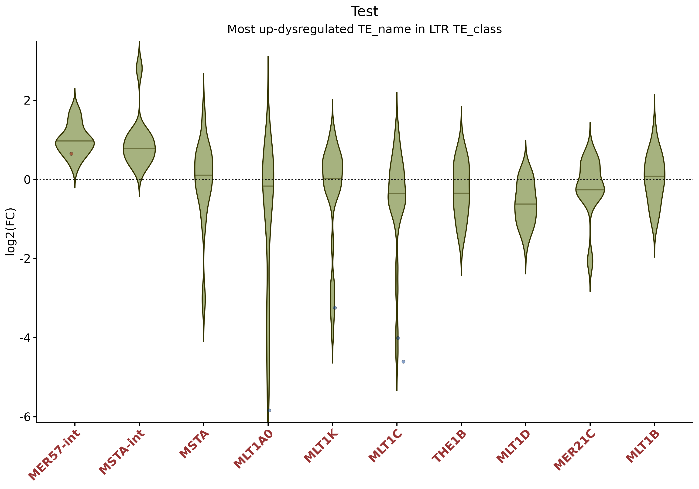
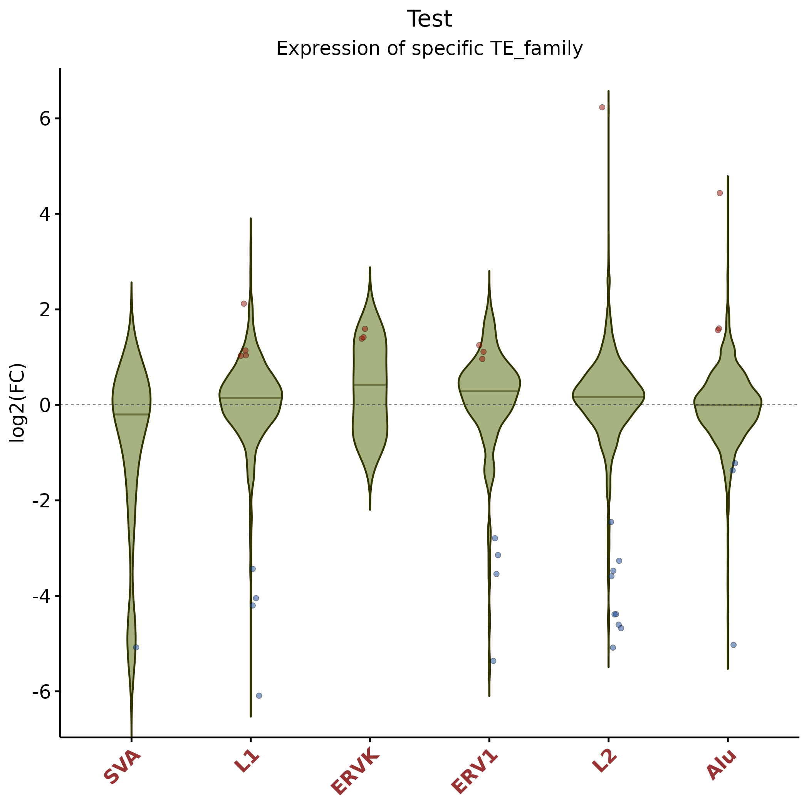

# TExpress

[](https://www.r-project.org/)
[](LICENSE)

> Comprehensive tools for analyzing transposable element (TE) expression, genomic annotation, and transcriptional classification.

**TExpress** provides a complete workflow for differential expression analysis 
of transposable elements, including:

- Statistical analysis using DESeq2
- Genomic context annotation relative to protein-coding genes
- Visualization of TE expression patterns
- Classification of TEs by transcriptional origin (self-expressed vs. gene-dependent)

---

## Installation

Install the development version from GitHub:
```r
# Install remotes if needed
if (!requireNamespace("remotes", quietly = TRUE)) {
  install.packages("remotes")
}

# Install TExpress
remotes::install_github("GuillePeris/TExpress", 
                        upgrade = "never",
                        dependencies = TRUE)
```

---

## Quick Start
```r
library(TExpress)

# Download test data
my.data <- downloadTestData()

# Run differential expression analysis
TE_results <- TE_DEA(
  metafile = my.data$metafile,
  folder = my.data$folder,
  gtf.TE.file = my.data$gtf.TE.file,
  output = "results",
  plot.title = "My Analysis"
)

# Annotate TEs with genomic context
TE_results <- TE_regionAnnot(
  TE_results = TE_results,
  gtf.genes.file = my.data$gtf.gene.file,
  output_folder = "results"
)
```

---

## Input Requirements

### 1. TE Count Files

**TExpress** is designed to work with count tables generated by [TElocal](https://github.com/mhammell-laboratory/TEtranscripts) from the TEtranscripts package.

### 2. Metadata File

A **tab-separated** text file describing your samples. The file must contain exactly four columns with specific headers and requirements:

| Column | Description | Requirements |
|--------|-------------|--------------|
| `File` | TE count file names | Must match files in count directory |
| `Sample` | Unique sample identifiers | Used as column names in output |
| `Group` | Sample group labels | For organizing samples |
| `Condition` | Experimental condition | **Must** be "Control" or "Treat" |

**Example metadata file:**
```
File	Sample	Group	Condition
TElocal_WT1.cntTable	WT1	WT	Control
TElocal_WT2.cntTable	WT2	WT	Control
TElocal_WT3.cntTable	WT3	WT	Control
TElocal_WT4.cntTable	WT4	WT	Control
TElocal_KO1.cntTable	KO1	KO	Treat
TElocal_KO2.cntTable	KO2	KO	Treat
TElocal_KO3.cntTable	KO3	KO	Treat
TElocal_KO4.cntTable	KO4	KO	Treat
```

> ⚠️ **Important:** The `Condition` column must contain exactly "Control" and "Treat" (case-sensitive) for DESeq2 analysis.

### 3. Annotation Files

- **TE GTF file**: TE annotation matching the one used by TElocal
- **Gene GTF file**: Protein-coding gene annotations (e.g., from GENCODE or Ensembl)

---

## Workflow

### Step 1: Differential Expression Analysis

Perform statistical analysis to identify differentially expressed TEs between conditions.
```r
library(TExpress)

# Download test data (or specify your own paths)
my.data <- downloadTestData()

# Define parameters
metafile <- my.data$metafile        # Path to metadata file
folder <- my.data$folder            # Directory with count files
gtf.TE.file <- my.data$gtf.TE.file  # TE annotation GTF
output <- "results"                 # Output directory
maxpadj <- 0.05                     # Adjusted p-value threshold
minlfc <- 1                         # Log2 fold change threshold (2-fold)
device <- c("pdf", "png")           # Output formats for plots
plot.title <- "DGCR8-KO vs WT"      # Title for plots

# Run differential expression analysis
TE_results <- TE_DEA(
  metafile = metafile,
  folder = folder,
  output = output,
  maxpadj = maxpadj,
  minlfc = minlfc,
  gtf.TE.file = gtf.TE.file,
  device = device,
  plot.title = plot.title
)
```

**Output:**

- DESeq2 results for genes and TEs (separate directories)
- Normalized count matrices
- Volcano plots and MA plots
- Summary statistics

---

#### TE Nomenclature

TExpress uses a hierarchical classification system for TEs:
```
TE_element : TE_name : TE_family : TE_class
```

**Example:** `L1PA2_dup501:L1PA2:L1:LINE`

- **TE_class**: Broad category (LINE, SINE, LTR, DNA)
- **TE_family**: Family within class (L1, Alu, ERVK, etc.)
- **TE_name**: Specific TE type (L1PA2, AluY, etc.)
- **TE_element**: Individual genomic locus (L1PA2_dup501)

This hierarchy allows flexible visualization at different taxonomic levels.

---

#### Violin Plots by TE Type

Display expression distribution for top TEs within a specific type.

**Example 1: Top LTR families**
```r
violinPlotByTEtype(
  res.TEs = TE_results$res.TEs,
  TE_type = "LTR",                 # TE class to analyze
  specific_type = "TE_family",     # Grouping level
  nTop = 10,                       # Show top 10 families
  order = "up",                    # Order by upregulated count
  minlfc = 1,
  maxpadj = 0.05,
  width = 14,
  height = 7,
  device = "png",
  output_folder = paste0(output, "/TEs_DEA"),
  plot.title = plot.title
)
```



**Example 2: Top LTR elements by name**
```r
violinPlotByTEtype(
  res.TEs = TE_results$res.TEs,
  TE_type = "LTR",
  specific_type = "TE_name",       # More specific grouping
  nTop = 10,
  width = 10,
  height = 7,
  device = "png",
  output_folder = paste0(output, "/TEs_DEA"),
  plot.title = plot.title
)
```



#### Violin Plots for Custom TE Lists

Compare expression across a custom list of TEs at the same hierarchical level.
```r
violinPlotByTEList(
  res.TEs = TE_results$res.TEs,
  TE_list = c("L1", "ERVK", "L2", "ERV1", "Alu", "SVA"),
  minlfc = 1,
  maxpadj = 0.05,
  width = 7,
  height = 7,
  device = "png",
  output_folder = paste0(output, "/TEs_DEA"),
  plot.title = plot.title
)
```



---

### Step 2: Genomic Context Annotation

Annotate TEs with their genomic location relative to protein-coding genes.
```r
TE_results <- TE_regionAnnot(
  TE_results = TE_results,
  gtf.genes.file = my.data$gtf.gene.file,
  output_folder = output,
  device = c("pdf", "png"),
  plot.title = plot.title,
  minCounts = 10  # Minimum normalized counts for inclusion
)
```

**Output:**

- Annotated TE results with genomic coordinates
- Gene associations (nearest gene for each TE)
- Stacked bar plots showing:
  - Distribution across genomic regions (Promoter, Exon, Intron, etc.)
  - Distribution across TE classes (LINE, SINE, LTR, DNA)

**Genomic Regions Annotated:**

- **Promoter**: Within 5kb upstream/downstream of TSS (configurable)
- **5' UTR**: Five-prime untranslated region
- **Exon**: Protein-coding exons
- **Intron**: Intronic regions
- **3' UTR**: Three-prime untranslated region
- **Downstream**: Up to 10kb downstream of gene end
- **Intergenic**: Not associated with any gene feature

---

### Step 3: Transcriptional Classification

Classify TEs as:

- **Self-expressed**: Transcribed from their own internal promoter
- **Gene-dependent**: Transcribed as part of host gene transcription (runthrough)

Use **save** variable to analyze "all" expressed TEs, "up"-regulated, "down"-regulated
or "dys"-regulated (up+down).

```r
TE_results_dys <- classify_TE_transcription(TE_results, 
                                            output_folder = output, 
                                            plot.title = plot.title,
                                            save = "dys")
```

---


## Example Dataset

The package includes a test dataset from chromosome 22:
```r
# Download to temporary directory
my.data <- downloadTestData()

# Or specify custom location
my.data <- downloadTestData(data_folder = "~/data/TExpress_test")
```

**Dataset details:**

- **Comparison**: DGCR8-KO vs. WT
- **Organism**: Human (hg38)
- **Chromosome**: chr22 only (for quick testing)
- **Replicates**: 4 per condition
- **Reference**: [GSE197472](https://www.ncbi.nlm.nih.gov/geo/query/acc.cgi?acc=GSE197472)

---


## Citation

If you use TExpress in your research, please cite:

Peris Guillermo, TExpress (2026). Github repository 
[https://github.com/GuillePeris/TExpress](https://github.com/GuillePeris/TExpress).

---

## License

This project is licensed under the MIT License - see the [LICENSE](LICENSE) file for details.

---

## Contact

**Maintainer:** Guillermo Peris Ripollés  
**Email:** [peris@uji.es]  
**GitHub:** [@GuillePeris](https://github.com/GuillePeris)
