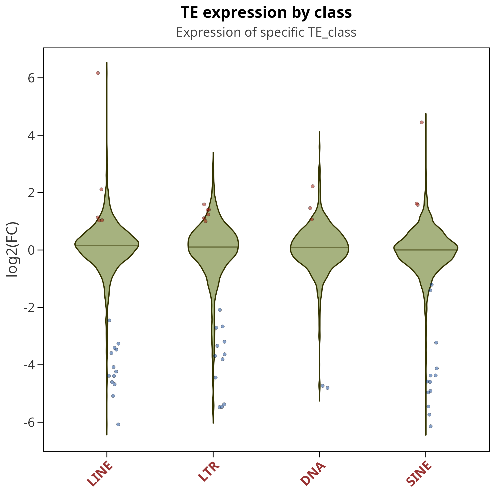
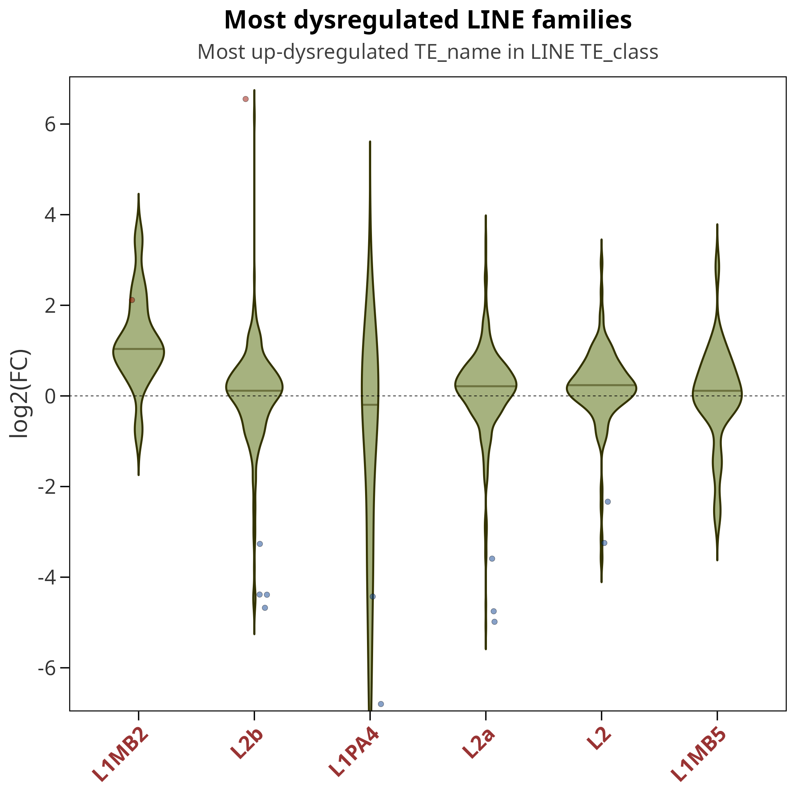
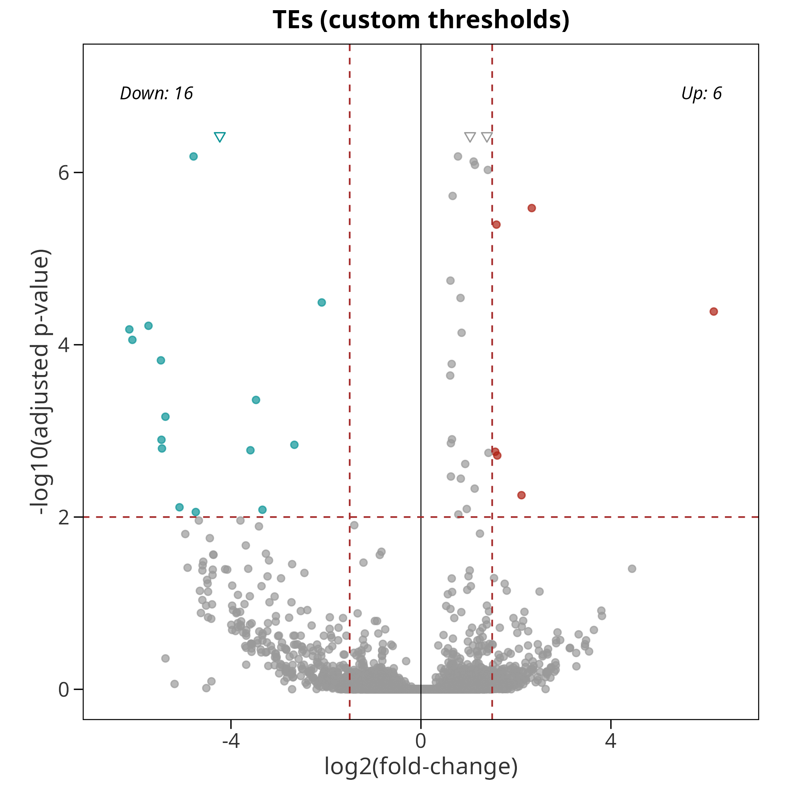

```{r, include = FALSE}
knitr::opts_chunk$set(
  collapse = TRUE,
  comment = "#>",
  out.width = "100%",
  fig.align = "center"
)
```

# Introduction

**TExpress** is an R package for the downstream analysis of transposable
element (TE) expression from quantification tools such as
[TElocal](https://github.com/mhammell-laboratory/TElocal) (part of the
*TEtranscripts* suite). In addition to performing differential expression
analysis with *DESeq2*, **TExpress** annotates TEs with respect to genomic
features and classifies their expression as originating either from the TE's
own promoter (*self-expressed*) or from an external promoter, typically a
nearby gene (*gene-dependent*).

The analysis is organized as a three-stage pipeline, where each stage consumes
and extends a single result list:

1. `TE_DEA()` — reads the metadata and count tables, runs DESeq2, and returns
   a list with `res.TEs`, `TE.count`, `gene.count`, and `metadata`.
2. `annotate_TE_regions()` — adds genomic-context annotation
   (Promoter / Exon / Intron / ...) relative to a gene GTF.
3. `classify_TE_transcription()` — labels each TE as self-expressed or
   gene-dependent.

Each stage also writes publication-ready figures and result tables to disk. The
figures shown throughout this vignette were generated by running the pipeline on
the example dataset described below.

```{r overview, echo = FALSE, fig.cap = "TExpress pipeline overview: the output of each stage is the input of the next."}
knitr::include_graphics("../man/figures/pipeline_overview.png")
```

```{r setup, eval = FALSE}
library(TExpress)
```

# Two conventions to know

## The colon-separated TE identifier

TE features are identified by a colon-separated, four-level hierarchy used as
the row name of every TE table:

```
TE_element : TE_name : TE_family : TE_class
e.g.  L1PA2_dup501 : L1PA2 : L1 : LINE
```

The presence of `:` in a feature's row name is how **TExpress** distinguishes
TEs from genes throughout the package, so this format must be preserved.

## The Control / Treat metadata

The metadata table must contain a `Condition` column with exactly the values
`"Control"` and `"Treat"` (case-sensitive). `TExpress` uses `Control` as the
reference level, so every reported contrast is **Treat vs. Control**. A minimal
metadata file is a tab-separated table with four columns: `File`, `Sample`,
`Group`, and `Condition`.

# Standard workflow

The chunks below are not evaluated when the vignette is built (they require the
Bioconductor stack and a ~90 MB download), but they show a complete, runnable
analysis. The figures accompanying each step are real outputs produced by these
exact calls on the example chr22 dataset.

## Getting example data

`downloadTestData()` fetches a small chr22 example dataset (gene GTF, TE GTF,
and count tables) and returns the paths needed by the pipeline.

```{r download, eval = FALSE}
my.data <- downloadTestData()

str(my.data)
#> List of 4
#>  $ metafile     : chr ".../data.csv"
#>  $ folder       : chr "..."
#>  $ gtf.gene.file: chr ".../Homo_sapiens.GRCh38.115_chr22.gtf"
#>  $ gtf.TE.file  : chr ".../hg38_rmsk_TE_chr22.gtf"
```

## Step 1: Differential expression analysis

`TE_DEA()` reads the metadata and counts, imports the TE GTF, and runs DESeq2,
writing volcano/MA plots and result tables to `output`.

```{r dea, eval = FALSE}
TE_results <- TE_DEA(
  metafile    = my.data$metafile,
  folder      = my.data$folder,
  gtf.TE.file = my.data$gtf.TE.file,
  output      = "results",
  maxpadj     = 0.05,
  minlfc      = 1,
  device      = c("png", "svg"),
  plot.title  = "DGCR8-KO vs WT"
)
```

The returned object is a list carrying the result data frames and counts that
the following stages extend. For the TE results, `TE_DEA()` writes a volcano plot
and an MA plot (a matching pair is also produced for genes):

```{r dea-fig, echo = FALSE, fig.show = "hold", out.width = "49%", fig.cap = "Step 1 — differential expression of TEs: volcano plot (left) and MA plot (right). Up- and down-regulated TEs are highlighted."}
knitr::include_graphics(c("figures/step1_volcano.png", "figures/step1_ma.png"))
```

## Step 2: Genomic-context annotation

`annotate_TE_regions()` assigns each TE to a genomic region (Promoter, 5' UTR,
Exon, Intron, 3' UTR, Downstream, or Intergenic) relative to the supplied gene
annotation, and produces stacked bar plots of the region and TE-class
distributions.

```{r annotate, eval = FALSE}
TE_results <- annotate_TE_regions(
  TE_results    = TE_results,
  gtf.genes.file = my.data$gtf.gene.file,
  output_folder = "results",
  device        = c("png", "svg"),
  minCounts     = 10,
  plot.title = "DGCR8-KO vs WT"
)
```

The stacked bar plots compare, side by side, the genomic-region and TE-class
composition of the TEs expressed in each condition and of the up/down-regulated
sets:

```{r annotate-fig, echo = FALSE, fig.show = "hold", out.width = "49%", fig.cap = "Step 2 — distribution of TEs across genomic regions (left) and TE classes (right) for control, treatment, down- and up-regulated groups."}
knitr::include_graphics(c("figures/step2_region.png", "figures/step2_teclass.png"))
```

## Step 3: Transcriptional classification

Finally, `classify_TE_transcription()` labels expressed TEs as *self-expressed*
(transcribed from their own internal promoter) or *gene-dependent* (transcribed
as part of host-gene transcription). The `save` argument selects which set of
TEs to analyze: `"all"`, `"up"`, `"down"`, or `"dys"` (up + down).

```{r classify, eval = FALSE}
TE_results <- classify_TE_transcription(
  TE_results    = TE_results,
  output_folder = "results",
  plot.title    = "DGCR8-KO vs WT",
  save          = "dys"
)
```

Among others, this step produces a bar plot of the self-expressed fraction per
TE class and a bar plot of the TE families contributing most self-expressed
loci:

```{r classify-fig, echo = FALSE, fig.show = "hold", out.width = "49%", fig.cap = "Step 3 — self-expressed TEs broken down by TE class (left) and the families contributing the most self-expressed loci (right)."}
knitr::include_graphics(c("figures/step3_barplot_classes.png", "figures/step3_selfexpr_families.png"))
```

# Beyond the pipeline: standalone plots

Several plotting functions can be called directly on a result data frame, outside
the three-stage pipeline. This is useful for focusing on a particular set of TEs
or for re-plotting with different thresholds. All of them operate on
`TE_results$res.TEs` (the TE results data frame, which carries the
`log2FoldChange`, `padj`, and the `TE_element` / `TE_name` / `TE_family` /
`TE_class` columns).

## Violin plots for selected TEs

`violinPlotByTEList()` draws one violin per element of a TE list that all sit at
the same level of the hierarchy — for example the four main TE classes — showing
the distribution of log2 fold changes, with significantly up- and down-regulated
loci overlaid as points:

```{r violin-list, eval = FALSE}
violinPlotByTEList(
  res.TEs    = TE_results$res.TEs,
  TE_list    = c("LINE", "SINE", "LTR", "DNA"),
  minlfc     = 1,
  maxpadj    = 0.05,
  plot.title = "TE expression by class",
  output_folder = "results/TEs_DEA"
)
```

```{r violin-list-fig, echo = FALSE, out.width = "70%", fig.cap = "violinPlotByTEList(): log2 fold-change distribution for each TE class."}

```

`violinPlotByTEtype()` zooms into a single TE type and shows the most
dysregulated members at a finer level (here, the top LINE families by name):

```{r violin-type, eval = FALSE}
violinPlotByTEtype(
  res.TEs       = TE_results$res.TEs,
  TE_type       = "LINE",
  specific_type = "TE_name",
  nTop          = 6,
  plot.title    = "Most dysregulated LINE families",
  output_folder = "results/TEs_DEA"
)
```

```{r violin-type-fig, echo = FALSE, out.width = "70%", fig.cap = "violinPlotByTEtype(): the most dysregulated LINE elements, one violin per name."}

```

## Re-using the pipeline plot functions directly

The figures shown in the standard workflow are produced internally by exported
functions you can also call yourself: `graphTE_DEA()` (volcano + MA),
`graphTEregion()` (region / TE-class stacked bars) and `graph_classify_TE()`
(classification bar plots). Calling them directly lets you re-plot the same
results with different significance thresholds, output formats or titles. For
instance, to redraw the TE volcano/MA pair with stricter cutoffs:

```{r standalone-dea, eval = FALSE}
graphTE_DEA(
  res           = TE_results$res.TEs,
  maxpadj       = 0.01,
  minlfc        = 1.5,
  device        = "png",
  output_folder = "results/custom",
  plot.title    = "TEs (custom thresholds)"
)
```

```{r standalone-dea-fig, echo = FALSE, out.width = "60%", fig.cap = "graphTE_DEA() called directly with stricter thresholds (padj < 0.01, |log2FC| > 1.5)."}

```

Any of these functions can be saved in several formats at once via the `device`
argument (e.g. `device = c("png", "svg")`), and the low-level helper
`printDevice()` is exported for saving an arbitrary `ggplot` object to multiple
formats.

## Donut charts (optional)

For a per-class donut chart of the expression-type breakdown,
`create_pie_donut()` is also available. It depends on the
[`webr`](https://github.com/cardiomoon/webr) package, which is no longer
maintained and emits deprecation warnings, so it is not run in this vignette; see
`?create_pie_donut` for usage.

# Restricting the gene annotation (optional)

You should be aware that all reads overlapping gene feature annotation and 
TE annotation in the same strand are assigned to genes by *TElocal*.
If you are interested in restricting you gene annotation to only some features (for example, protein_coding and lncRNA) you can use
**TExpress** function *filter_GTF*:

```{r filter, eval = FALSE}
filter_GTF(
  "Homo_sapiens.GRCh38.115.gtf",
  features   = c("protein_coding"),
  format.in  = "gtf",
  format.out = "gtf",
  suffix     = "filtered"
)
```


# Session information

```{r session-info}
sessionInfo()
```
